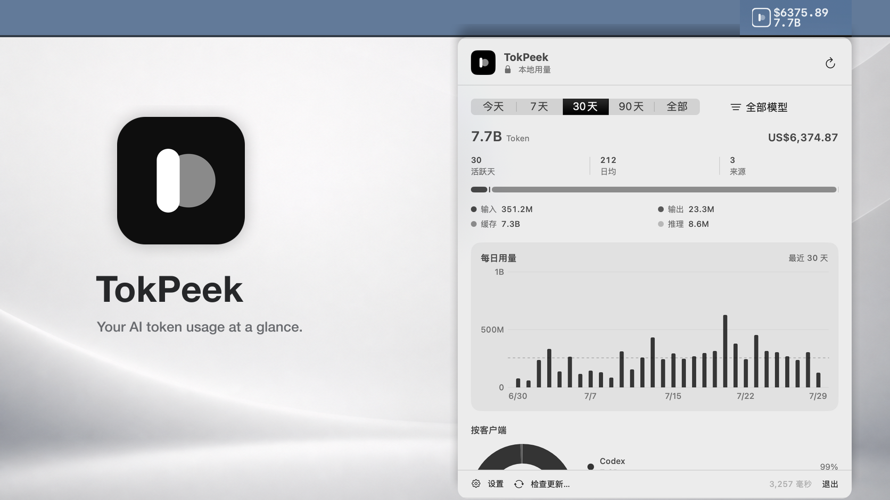

# TokPeek

<p align="center">
  
</p>

<p align="center">
  <strong>Your AI token usage at a glance.</strong>
</p>

<p align="center">
  <a href="https://github.com/murongg/TokPeek/releases/latest"></a>
  <a href="https://github.com/murongg/TokPeek/releases"></a>
  <a href="https://github.com/murongg/TokPeek/actions/workflows/ci.yml"></a>
  <a href="https://github.com/murongg/TokPeek/releases/latest"></a>
  <a href="https://github.com/murongg/TokPeek/releases/latest"></a>
  <a href="LICENSE"></a>
</p>

<p align="center">
  <a href="https://github.com/murongg/TokPeek/releases/latest"><strong>Download the latest release</strong></a>
  ·
  <a href="https://github.com/murongg/TokPeek/releases">All releases</a>
  ·
  <a href="README.zh-CN.md">简体中文</a>
</p>

TokPeek turns local AI usage logs into a glanceable macOS menu bar dashboard.
See token totals, estimated cost, daily trends, client share, and model rankings
without sending session contents to a server.

## Download

| Package | Link |
| --- | --- |
| Latest macOS Universal 2 ZIP — Apple Silicon and Intel | [Download from the latest release](https://github.com/murongg/TokPeek/releases/latest) |
| SHA-256 checksum and release notes | [Open the latest release](https://github.com/murongg/TokPeek/releases/latest) |
| Previous versions | [Browse all releases](https://github.com/murongg/TokPeek/releases) |

Published releases require **macOS 14 or later**, include native support for
Apple Silicon and Intel Macs, and are signed with Developer ID and notarized by
Apple.

### Install

1. Open the [latest release](https://github.com/murongg/TokPeek/releases/latest)
   and download the `TokPeek-<version>-macOS-universal.zip` asset.
2. Move `TokPeek.app` to the Applications folder.
3. Open TokPeek and keep its status in the menu bar.

TokPeek checks for signed updates through Sparkle. Updates are never installed
without confirmation.

## Why TokPeek

| Native and glanceable | Local by default | Useful breakdowns |
| --- | --- | --- |
| A real SwiftUI `MenuBarExtra` that stays one click away. | Session discovery, parsing, pricing, and aggregation run on your Mac. | Compare periods, filter by model, and inspect daily, client, and model usage. |

## Features

- Two-line menu bar status with estimated cost and token usage
- Alternate menu bar modes for tokens, cost, or the app icon
- Today, 7-day, 30-day, 90-day, and all-time reporting
- Model filtering across totals, charts, clients, and rankings
- Token composition, daily usage, client share, and two-column model ranking
- Daily, weekly, or monthly cost and token budgets with month-end forecasting
- Local macOS alerts when budget usage reaches 80% and 100%
- Tooltips for chart values and detailed usage metadata
- Configurable refresh interval and default reporting period
- Optional launch at login through `SMAppService`
- English and Simplified Chinese localization
- Light and dark appearance, keyboard access, and VoiceOver labels
- Secure in-app updates through Sparkle

## Architecture

```text
SwiftUI menu bar
    ↓
TokPeekKit models and state
    ↓
TokPeekBridge (JSON over C ABI)
    ↓
tokpeek-core-ffi (Rust static library)
    ↓
tokscale-core
```

TokPeek currently calls `generate_local_graph_report`, so Swift does not parse
session files or recalculate usage totals.

## Development

- macOS 14 or later
- Xcode 16 or later
- Swift 6
- Current stable Rust toolchain
- Rust targets `aarch64-apple-darwin` and `x86_64-apple-darwin` for Release

Install both release targets with:

```bash
rustup target add aarch64-apple-darwin x86_64-apple-darwin
```

### Open in Xcode

TokPeek includes a shared Xcode project and scheme:

```bash
open TokPeek.xcodeproj
```

The `Build Tokscale Core` phase invokes Cargo before Swift links the app. Release
builds combine the two Rust archives into a Universal 2 static library. Sparkle
2 is resolved through Swift Package Manager for secure in-app updates.

The checked-in project is generated by `scripts/generate-project.rb`. Maintainers
with the `xcodeproj` Ruby gem can regenerate it with:

```bash
make project
```

### Build and run

```bash
make run
```

The first build takes longer because Cargo compiles Tokscale Core and its
dependencies.

Run Rust, Swift Package Manager, and Xcode scheme tests:

```bash
make test
```

Create a hardened, ad-hoc signed application bundle:

```bash
make app
open dist/TokPeek.app
```

For Developer ID signing, supply the identity:

```bash
CODE_SIGN_IDENTITY="Developer ID Application: Your Name (TEAMID)" make app
```

The app target intentionally does not enable App Sandbox because Tokscale Core
must discover session files belonging to supported coding tools. Hardened
runtime remains enabled for signed builds.

## Releases and updates

The CI workflow runs the Rust, Swift Package Manager, and Xcode test suites for
pushes to `main` and pull requests. It also creates and verifies a Universal 2
Release build.

Stable releases are created from semantic version tags:

```bash
git tag -a v0.1.0 -m "TokPeek v0.1.0"
git push origin v0.1.0
```

The Release workflow verifies the full test suite, injects the tag version into
the app bundle, signs it with Developer ID, submits it for Apple notarization,
staples the accepted ticket, and publishes a Universal 2 ZIP, a SHA-256
checksum, and a signed Sparkle appcast to GitHub Releases. Installed builds
check that feed daily by default and always ask before installing an update.

Apple and Sparkle signing credentials are supplied only through encrypted
GitHub Secrets and are removed from the ephemeral runner after every release.
See [RELEASING.md](RELEASING.md) for certificate, API key, and secret setup.

## Tokscale Core

The Rust bridge pins Tokscale to commit
`f36931d33a61bf07c788fbbd2dacb0266277acf6`. Upgrades should be reviewed and
tested deliberately because local session formats and report contracts can
change.

## Privacy

TokPeek reads supported AI session data locally through Tokscale Core. The app
does not contain analytics or upload session contents.

## License

TokPeek is available under the MIT License. Tokscale Core is also MIT licensed;
see [THIRD_PARTY_NOTICES.md](THIRD_PARTY_NOTICES.md).
